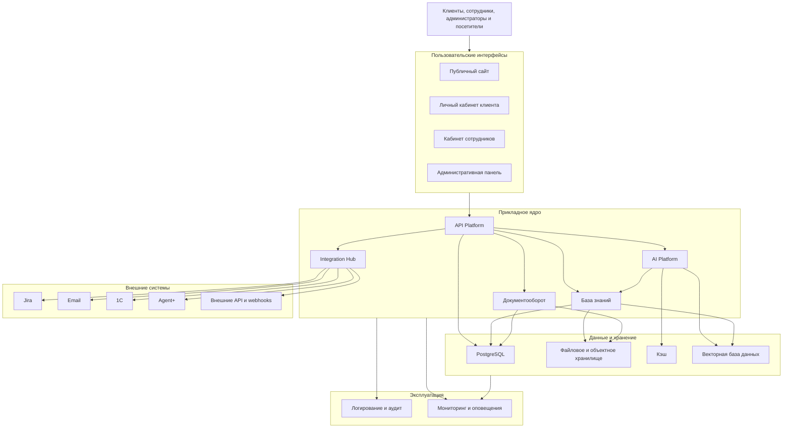

# Avantime Platform — Архитектура 2.0

Этот документ определяет целевую архитектуру Avantime Platform версии 2.0 и план перехода от текущего состояния. Архитектура следует принципам безопасности, модульности, обратимости изменений и повторного использования компонентов.

# 1. Общая архитектура платформы

## Логическая схема

На этапе 2.0 платформа развивается как модульный монолит на базе существующего приложения Next.js. Подсистемы имеют явные границы, собственные прикладные сервисы и стабильные контракты, но используют единый процесс развёртывания. Отдельные сервисы выделяются только при наличии требований к независимому масштабированию, изоляции или жизненному циклу.

## Публичный сайт

**Назначение:** представление Avantime, его услуг, решений, экспертизы и материалов для потенциальных клиентов.

**Основные функции:**

- страницы компании, услуг и решений;
- публикация новостей, статей и вебинаров;
- публичная база знаний;
- формы контакта и запрос консультации;
- переход в личный кабинет и AI-помощник;
- поисковая оптимизация, локализация и аналитика.

**Взаимодействие:** получает опубликованный контент из базы знаний, отправляет формы через API, использует общие компоненты интерфейса и может предоставлять ограниченный публичный доступ к AI.

## Личный кабинет клиента

**Назначение:** единое защищённое пространство клиента для взаимодействия с Avantime.

**Основные функции:**

- управление обращениями, сообщениями и вложениями;
- работа с документами и знаниями;
- AI-помощник;
- управление компанией, командой и уведомлениями;
- просмотр состояния интеграций и проектов;
- профиль и настройки безопасности.

**Взаимодействие:** работает только через защищённый API, использует PostgreSQL, файловое хранилище, AI Platform, базу знаний, Jira и Email.

## Кабинет сотрудников

**Назначение:** рабочее пространство консультантов, поддержки, редакторов и технических специалистов.

**Основные функции:**

- очередь клиентских обращений и контроль SLA;
- коммуникация с клиентами;
- работа с проектами и документами;
- подготовка и проверка материалов базы знаний;
- AI-подсказки, классификация и подготовка ответов;
- просмотр состояния интеграций.

**Взаимодействие:** использует общие доменные модули поддержки, документов и знаний, но имеет отдельные права доступа и представления данных.

## Административная панель

**Назначение:** централизованное управление платформой, организациями, пользователями, контентом, AI и интеграциями.

**Основные функции:**

- управление пользователями, ролями и компаниями;
- публикация контента;
- управление AI-моделями и политиками;
- управление интеграциями и секретами;
- просмотр очередей, логов, аудита и мониторинга;
- системные настройки без отображения значений секретов.

**Взаимодействие:** обращается к административным API, сервису идентификации, AI Gateway, Integration Hub и подсистеме наблюдаемости.

## AI Platform

**Назначение:** единый интеллектуальный слой платформы.

**Основные функции:**

- доступ к нескольким поставщикам моделей;
- маршрутизация, контроль стоимости и ограничений;
- RAG, embeddings и инструменты;
- история диалогов и библиотека prompts;
- управление AI-агентами;
- оценка качества и аудит AI-взаимодействий.

**Взаимодействие:** получает запросы только через AI Gateway, использует знания и документы в пределах прав пользователя, вызывает разрешённые инструменты через API и MCP.

## База знаний

**Назначение:** единый управляемый источник проверенных знаний.

**Основные функции:**

- публичные и закрытые материалы;
- категории, теги, статусы и версии;
- полнотекстовый и семантический поиск;
- обработка документов и мультимедиа;
- выдача контекста для RAG;
- контроль источников и актуальности.

**Взаимодействие:** хранит метаданные в PostgreSQL, файлы в объектном хранилище, векторы в векторной базе и предоставляет данные сайту, кабинетам и AI Platform.

## Документооборот

**Назначение:** безопасное управление жизненным циклом документов.

**Основные функции:**

- загрузка, скачивание и удаление;
- метаданные, версии и права;
- извлечение текста и предварительный просмотр;
- согласование, подписание и архивирование;
- антивирусная проверка и контроль типов файлов;
- подготовка содержимого для поиска и RAG.

**Взаимодействие:** использует PostgreSQL, объектное хранилище, фоновые задачи, базу знаний, AI Platform и интеграции электронного документооборота.

## Интеграции

**Назначение:** надёжный обмен данными с внешними системами.

**Основные функции:**

- коннекторы и настройки подключений;
- исходящие и входящие webhooks;
- очереди, повторные попытки и идемпотентность;
- преобразование и проверка данных;
- журналирование и мониторинг обменов;
- управление версиями контрактов.

**Взаимодействие:** получает команды от прикладных модулей, взаимодействует с Jira, 1С, Agent+, Email и другими сервисами через Integration Hub.

## API

**Назначение:** единая контролируемая граница между интерфейсами, модулями и внешними клиентами.

**Основные функции:**

- прикладные и административные маршруты;
- аутентификация, авторизация и проверка входных данных;
- версионирование контрактов;
- rate limit и идемпотентность;
- документация и аудит;
- webhooks и служебные интеграционные API.

**Взаимодействие:** направляет запросы в доменные сервисы и не предоставляет пользовательским интерфейсам прямой доступ к базе данных или хранилищам.

## PostgreSQL

**Назначение:** основное транзакционное хранилище платформы.

**Основные функции:**

- пользователи, компании и роли;
- обращения, сообщения, статусы и аудит;
- метаданные документов;
- статьи и версии базы знаний;
- история диалогов и AI-метаданные;
- конфигурация интеграций без секретных значений.

**Взаимодействие:** доступ осуществляется через слой репозиториев и Prisma. Модули не должны обращаться к таблицам других доменов в обход согласованных сервисов.

## Файловое хранилище

**Назначение:** хранение оригиналов документов, вложений, производных файлов и архивов.

**Основные функции:**

- безопасная загрузка и скачивание;
- шифрование, версии и сроки хранения;
- временные подписанные ссылки;
- резервное копирование;
- хранение извлечённого текста и превью при необходимости.

**Взаимодействие:** локальное хранилище допускается только для разработки. Производственная среда использует S3-совместимое объектное хранилище через единый адаптер.

### Первая итерация tenant-aware хранения

В TASK-002 зафиксированы следующие внутренние контракты модульного монолита:

- `DocumentStorage` отвечает только за tenant-scoped чтение, запись и удаление объектов;
- `DocumentMetadataRepository` является границей доступа к обязательным метаданным документа;
- `DocumentProcessingRepository` хранит и читает извлечённый текст и chunks;
- `LocalDocumentStorage` реализует текущую development-файловую систему;
- `S3DocumentStorage` в первой итерации был зафиксирован только как будущий контракт.

Каждая операция получает серверный `DocumentTenantContext` с `companyId` и `userId`. API не принимает tenant из пользовательского payload. Локальные данные разделены по компании, ключи хранилища являются отдельными безопасными сегментами и не могут содержать path traversal.

Канонические метаданные содержат `companyId`, `uploadedBy`, `status`, `originalName`, `storedName`, `mimeType`, `size`, `createdAt` и `updatedAt`. Для прежних development-данных допускается однократная совместимая нормализация в системный tenant `avantime`; это не является production-миграцией.

TASK-007 разделяет document permissions по операции. Tenant-scoped list/item/file/text/search/RAG
доступны активному участнику компании и возвращают client-safe projection. Upload, delete,
reprocess, reindex, quarantine и operational details остаются `ADMIN`-only. API не принимает
`companyId` из client input; tenant выводится из повторно проверенной server session.

### Вторая итерация production persistence

Во второй итерации TASK-002 реализованы две production-границы:

- `PostgreSQLDocumentMetadataRepository` использует Prisma и во всех list/get/update/delete запросах включает `companyId`;
- `S3DocumentStorage` хранит приватные объекты с ключом `documents/{companyId}/{kind}/{key}` и не создаёт публичные или signed URLs.

Prisma-модель metadata использует составной первичный ключ `(companyId, id)`, индексы по tenant, status и времени создания, обязательный SHA-256 checksum и `deletedAt`. Статусы API преобразуются в ограниченный database enum, а даты проверяются на границе repository.

Выбор adapters выполняет единая configuration factory. Development без явной настройки использует local/local. Production выбирает PostgreSQL/S3 и завершается понятной ошибкой при отсутствии database или object-storage configuration. API routes не создают реализации напрямую и не принимают `companyId` из request.

Удаление разделено на два этапа:

1. Document API выполняет soft delete metadata;
2. отдельная cleanup command удаляет original/text/chunks и только после этого физически удаляет metadata.

Если удаление объекта завершается ошибкой, soft-deleted metadata сохраняется для повторной попытки и расследования. Автоматический cleanup не запускается, пока не будет выбран механизм очередей и operational policy.

Legacy migration читает `.data`, вычисляет checksum, переносит metadata в PostgreSQL и объекты в S3. Поддерживаются dry-run и повторный запуск; локальные файлы не удаляются.

### Третья итерация фоновой обработки

TASK-002 отделяет resource-intensive PDF extraction от upload HTTP request следующими границами:

- `DocumentProcessingQueue` управляет tenant-scoped enqueue, exclusive claim, acknowledge и delayed release;
- `DocumentProcessingJob` содержит только безопасные внутренние идентификаторы и operational metadata;
- `DocumentProcessingWorker` восстанавливает tenant из server-side configuration, читает оригинал через `DocumentStorage` и сохраняет derivatives через `DocumentProcessingRepository`;
- `LocalDocumentProcessingQueue` является persistent development/test adapter;
- `ExternalDocumentProcessingQueue` фиксирует production-контракт, но конкретный provider и infrastructure пока не выбраны.

Metadata использует типобезопасные состояния `UPLOADED`, `QUEUED`, `PROCESSING`, `COMPLETED`, `FAILED`, `QUARANTINED` и `DELETED`. Переходы централизованы и выполняются repository как tenant-scoped conditional update. Lifecycle metadata хранит число попыток, безопасный код/сообщение ошибки, время начала/завершения, `nextRetryAt`, `quarantinedAt` и `workerId`.

Upload сохраняет оригинал и metadata `UPLOADED`, затем идемпотентно ставит job и переводит документ в `QUEUED`. Worker получает эксклюзивный lease, переводит документ в `PROCESSING`, проверяет SHA-256 до extraction, сохраняет полный text/chunks и только затем ставит `COMPLETED`. Partial derivatives удаляются и не считаются завершённой обработкой.

Временные ошибки получают exponential backoff до настраиваемого лимита. Постоянные ошибки переходят в `FAILED`, а исчерпавшие retry limit — в `QUARANTINED`. Tenant-aware `ADMIN`-only API поддерживает list, single-document retry, resolve при полном результате и permanently fail. Массовые destructive operations отсутствуют.

Local queue сохраняет job и lease между перезапусками, но не гарантирует distributed locking между несколькими процессами или узлами. Production запрещает local queue и работает fail-fast без external adapter. Worker не запускается автоматически; provider, process manager, metrics и alerts требуют отдельного решения.

### Четвёртая итерация инфраструктурной валидации

Отдельный Docker Compose поднимает PostgreSQL и MinIO только для local/integration testing. Он использует loopback ports, отдельные database/bucket/volumes и безопасные тестовые credentials. Production deployment не изменяется, а integration commands отклоняют production mode, remote endpoints и targets без маркера `integration`.

Реальные integration tests проверяют:

- tenant-aware PostgreSQL repository, conditional claim, soft delete, processing metadata, индексы и constraint;
- MinIO-compatible storage, tenant-prefixed keys, checksum, path traversal, удаление и last-write-wins;
- полный PDF flow через PostgreSQL, MinIO и существующую local queue без AI API.

Migration rehearsal применяет Prisma migrations к пустой и legacy test database, проверяет преобразование статусов/defaults/indexes/constraints и повторный deploy. Rehearsal databases имеют валидируемые integration-имена и удаляются после проверки.

Document health разделён на публичные минимальные liveness/readiness ответы и `ADMIN`-only component diagnostics. Readiness выполняет только безопасные read/list operations. Worker поддерживает graceful shutdown: после `SIGINT`/`SIGTERM` завершает текущий `runOnce`, не claim следующий job и полагается на lease recovery при аварийной остановке.

Этот integration boundary не является production Infrastructure as Code. Managed providers, bucket encryption/versioning, external queue, distributed supervision, backup/restore, SLO, metrics и alerts остаются отдельными инфраструктурными решениями.

## Jira

**Назначение:** внутренняя система управления задачами поддержки и реализации.

**Основные функции:**

- создание задач из обращений;
- двусторонняя синхронизация статусов;
- синхронизация разрешённых комментариев и вложений;
- сопоставление пользователей и приоритетов.

**Взаимодействие:** доступ к Jira выполняется только через Integration Hub. Сбой Jira не должен блокировать сохранение обращения клиента.

## Email

**Назначение:** транзакционные уведомления и коммуникация.

**Основные функции:**

- шаблоны писем;
- очередь отправки и повторные попытки;
- уведомления об обращениях, сообщениях и восстановлении доступа;
- журнал доставки;
- управление предпочтениями пользователя.

**Взаимодействие:** прикладные модули создают события уведомлений, а Email-адаптер доставляет сообщения через настроенного провайдера.

## Логирование

**Назначение:** диагностика, аудит и расследование событий.

**Основные функции:**

- структурированные технические логи;
- неизменяемый аудит значимых действий;
- корреляционные идентификаторы;
- маскирование персональных данных и секретов;
- политики хранения.

**Взаимодействие:** все модули передают стандартизированные события в общую подсистему логирования.

## Мониторинг

**Назначение:** контроль доступности, производительности, ошибок и стоимости платформы.

**Основные функции:**

- метрики приложений и инфраструктуры;
- трассировка запросов;
- проверки доступности;
- оповещения и панели состояния;
- мониторинг очередей, интеграций и AI-затрат.

**Взаимодействие:** собирает телеметрию из приложений, баз данных, хранилищ, фоновых задач и внешних интеграций.

# 2. Архитектура AI

## AI Gateway

AI Gateway является единственной точкой доступа к моделям. Он выполняет аутентификацию, проверку прав, маршрутизацию, rate limit, контроль бюджета, фильтрацию данных, журналирование и нормализацию ответов.

Пользовательские и административные интерфейсы не должны напрямую вызывать SDK поставщиков моделей.

В TASK-004 граница реализована как внутренний модуль монолита с контрактами `AiGateway`, `EmbeddingProvider` и `RagAnswerProvider`. Fake/OpenAI/Gemini adapters выбираются централизованно; document/query embeddings, RAG generation и прежний административный AI route больше не создают provider SDK напрямую. Production configuration работает fail-fast.

## Провайдеры моделей

Все провайдеры реализуют общий контракт:

- генерация текста и структурированных ответов;
- потоковая передача;
- вызов инструментов;
- embeddings при поддержке;
- сведения о стоимости, задержке и лимитах;
- единая классификация ошибок.

### OpenAI

Основной провайдер для сложных рассуждений, работы с инструментами, документов и программного кода. Конкретная модель задаётся конфигурацией и не фиксируется в пользовательских компонентах.

### Gemini

Альтернативный провайдер для мультимодальных сценариев, обработки больших контекстов и резервной маршрутизации.

### Claude

Будущая поддержка реализуется новым адаптером без изменения прикладных модулей и API.

### Локальные LLM

Локальные модели предназначены для изолированных сред, чувствительных данных, предсказуемой стоимости и специальных отраслевых сценариев. Они подключаются через совместимый внутренний endpoint и проходят те же политики безопасности и качества.

## Маршрутизация запросов

Маршрутизатор выбирает модель по:

- типу задачи;
- требуемым возможностям;
- классификации данных;
- допустимой задержке;
- стоимости;
- доступности провайдера;
- предпочтениям организации;
- результатам оценки качества.

Должны поддерживаться основной провайдер, резервный провайдер и запрет автоматического переключения для данных с особыми требованиями.

## RAG

Конвейер RAG включает:

1. проверку прав пользователя;
2. определение области знаний организации;
3. нормализацию вопроса;
4. гибридный поиск;
5. повторное ранжирование;
6. формирование ограниченного контекста;
7. генерацию ответа;
8. обязательные ссылки на источники;
9. запись метрик и обратной связи.

Ответ не должен использовать документ, который пользователь не имеет права открыть напрямую.

Первая реализация TASK-004 сохраняет lexical retrieval, добавляет semantic retrieval и детерминированный weighted hybrid merge без neural reranker. `companyId` берётся только из ADMIN session. Citations строятся сервером после повторной проверки document/chunk, а retrieved excerpts передаются модели как недоверенные данные.

## Embeddings

Embeddings создаются асинхронно после обработки и разбиения содержимого. Для каждого вектора сохраняются версия модели, идентификатор фрагмента, организация, права доступа, язык и контрольная сумма исходного текста.

При смене модели переиндексация выполняется версионированно без остановки поиска.

Embedding lifecycle отделён от processing lifecycle. PostgreSQL/local queue поддерживает lease, recovery, retry/backoff и quarantine; content hash исключает повторную векторизацию неизменившихся chunks. Новая версия заменяет старую только после успешного завершения.

## Vector Database

Для версии 2.0 рационально использовать расширение `pgvector` в PostgreSQL, чтобы не вводить отдельную инфраструктуру раньше необходимости. Отдельная векторная база рассматривается при доказанных ограничениях по объёму, скорости или независимому масштабированию.

ADR-0020 закрепляет `pgvector` как реализацию TASK-004. Vector rows используют tenant/document/chunk/model/version identity и dimension constraint; integration environment проверяет extension, реальные insert/search, tenant isolation и migration rehearsal. ANN index откладывается до production load measurements.

## AI Cache

Кэш хранит только безопасные для повторного использования результаты. Ключ учитывает организацию, пользователя или область доступа, модель, версию prompt, параметры и контрольную сумму контекста.

Ответы с персональными или быстро меняющимися данными по умолчанию не кэшируются. Срок жизни и причина использования кэша должны быть наблюдаемыми.

## История диалогов

История хранится в PostgreSQL и включает:

- диалог и сообщения;
- пользователя и организацию;
- выбранную модель;
- ссылки на использованные источники;
- вызовы инструментов и подтверждения;
- оценку ответа;
- технические метрики без секретных данных.

Пользователь может удалять историю в пределах политики хранения организации.

## Prompt Library

Библиотека prompts хранит системные инструкции и шаблоны как версионируемые сущности. Для каждой версии фиксируются назначение, владелец, поддерживаемые модели, входная схема, дата публикации и результаты проверок.

Изменения production-prompts должны проходить review и оценку на контрольном наборе сценариев.

## AI Agents

AI-агент состоит из:

- роли и системной инструкции;
- разрешённых источников данных;
- списка инструментов;
- лимитов времени, стоимости и количества шагов;
- правил подтверждения;
- журнала действий;
- критериев успешного завершения.

Предлагаемые агенты: помощник пользователя, помощник поддержки, архитектор, редактор знаний, аналитик, разработчик и агент автоматизации.

## AI Tools

Инструменты предоставляют агентам узкие типизированные операции: найти статью, прочитать разрешённый документ, создать черновик обращения, получить статус интеграции или подготовить проект изменения.

Инструмент не должен предоставлять универсальный доступ к базе данных или файловой системе. Изменяющие операции требуют явной авторизации, а критические действия — подтверждения пользователя.

## MCP

MCP используется как стандарт подключения внешних инструментов и контекстных источников к AI Platform.

Требования к MCP-подключениям:

- реестр разрешённых серверов;
- аутентификация и изоляция организаций;
- минимальные права;
- классификация read-only и изменяющих инструментов;
- подтверждение значимых действий;
- тайм-ауты и ограничения;
- полный аудит вызовов;
- запрет передачи секретов в модель.

# 3. Архитектура клиентского кабинета

Клиентский кабинет строится как единое приложение с общей навигацией, сессией, моделью прав и дизайн-системой.

## Dashboard

Показывает состояние обращений, проектов, документов, уведомлений и интеграций, а также персональные рекомендации AI. Данные агрегируются сервером с учётом организации и роли.

Канонические маршруты находятся под `/portal`. Исторический `/dashboard/**` является только
compatibility layer и перенаправляет query/deep links в `/portal` либо, для административного
document tooling, в `/admin/documents`. Полная карта переноса находится в
`docs/PORTAL_ARCHITECTURE.md`.

## Обращения

Поддерживаются создание, категории, приоритеты, SLA, сообщения, вложения, история статусов и связь с Jira. Клиент видит только разрешённое представление внутренних процессов.

## Документы

Предоставляет загрузку, поиск, предварительный просмотр, версии, статусы обработки и безопасное скачивание. Доступ наследуется от компании, проекта или обращения.

## База знаний

Показывает опубликованные публичные материалы и закрытые материалы организации. Поиск учитывает язык, категорию, тип источника и права.

## AI-помощник

Работает через AI Gateway, использует только доступные пользователю знания и документы, показывает источники и запрашивает подтверждение перед изменяющими действиями.

## Компания

Содержит профиль организации, договорные и контактные сведения, подключённые продукты и настройки хранения данных.

## Пользователи

Уполномоченные пользователи управляют приглашениями, активностью и ролями внутри своей организации. Нельзя назначать системные административные роли.

## Настройки

Включают профиль, язык, тему, уведомления, безопасность, историю сессий и допустимые AI-модели.

## Интеграции

Показывают подключённые системы, состояние синхронизации, последние операции и понятные ошибки. Секретные значения никогда не возвращаются в интерфейс.

# 4. Архитектура административной панели

Административная панель отделяет системное администрирование от работы сотрудников поддержки. Все действия требуют соответствующих ролей и записываются в аудит.

## Пользователи

Поиск, приглашение, блокировка, восстановление доступа, просмотр активности и завершение сессий.

## Роли

Управление системными и организационными ролями, разрешениями и областями доступа. На первом этапе роли задаются кодом; настраиваемые роли вводятся после стабилизации модели прав.

## Компании

Управление организациями, пользователями, продуктами, лимитами, политиками хранения и интеграциями.

## Новости

Создание, редактирование, планирование и публикация новостей с локализацией и SEO-метаданными.

## Статьи

Управление черновиками, публикацией, архивированием, категориями, тегами, версиями и связями с источниками.

## Документы

Просмотр метаданных, статуса обработки, карантина, прав, версий и сроков хранения. Содержимое открывается только при наличии отдельного разрешения.

## AI

Управление провайдерами, моделями, маршрутами, prompts, лимитами, агентами, контрольными наборами, качеством и стоимостью.

## Интеграции

Настройка коннекторов, проверка доступности, управление очередями, повторный запуск операций и просмотр ошибок без раскрытия секретов.

## Настройки

Глобальные параметры платформы, политики безопасности, локализация, шаблоны уведомлений и feature flags.

## Мониторинг

Панели доступности, производительности, очередей, интеграций, AI-затрат и фоновой обработки.

## Логи

Раздельный доступ к техническим логам и аудиту. Поиск выполняется по времени, организации, пользователю, действию и корреляционному идентификатору.

# 5. Архитектура базы знаний

База знаний объединяет управляемый контент и документы, но сохраняет различия их жизненного цикла.

## Публичная база знаний

Доступна без входа и содержит только явно опубликованные материалы. Поддерживает категории, теги, локализацию, SEO, поиск и ссылки на связанные продукты.

## Закрытая база знаний

Доступна сотрудникам или конкретным организациям. Права задаются на уровне пространства, коллекции и при необходимости отдельного материала.

## Документы

Для каждого документа хранятся оригинал, метаданные, контрольная сумма, версия, владелец, права, статус обработки и производные представления.

### PDF

Извлекаются текст, страницы, структура и изображения при необходимости. Отсканированные документы направляются на OCR.

### Word

Извлекаются заголовки, абзацы, таблицы, ссылки и метаданные с сохранением структуры.

### Excel

Обрабатываются книги, листы, таблицы и диапазоны. Перед передачей в AI данные ограничиваются релевантными фрагментами.

### Видео

Хранятся метаданные, субтитры, расшифровка, временные метки и ссылки на фрагменты. Тяжёлое видео может храниться во внешнем защищённом сервисе.

## FAQ

FAQ является структурированным типом знания с вопросом, утверждённым ответом, категорией, аудиторией, владельцем и датой пересмотра.

## Поиск

Используется гибридный поиск:

- полнотекстовый поиск PostgreSQL;
- семантический поиск по embeddings;
- фильтры по организации, правам, языку, типу и статусу;
- повторное ранжирование;
- подсветка и ссылки на источник.

## RAG

RAG использует только опубликованные или разрешённые материалы, сохраняет связь ответа с конкретными версиями источников и не смешивает данные разных организаций.

## AI

AI предлагает теги, краткое содержание, связанные материалы, ответы и кандидатов на обновление, но публикация и изменение проверенных знаний требуют подтверждения редактора.

## Версионирование

Каждое существенное изменение создаёт новую версию. Хранятся автор, дата, причина, статус, контрольная сумма и предыдущая версия. Ссылки AI-ответов должны указывать на использованную версию.

# 6. Архитектура интеграций

Integration Hub предоставляет общий контракт коннекторов, очередей и наблюдаемости.

## Jira

- создание задач из обращений;
- двусторонняя синхронизация статусов;
- контролируемая передача комментариев и вложений;
- обработка webhook-событий;
- повторные попытки и сопоставление идентификаторов.

## 1С

- REST, OData, HTTP-сервисы и файловые обмены;
- синхронизация справочников и документов;
- очереди изменений и идемпотентность;
- контроль версий конфигураций;
- безопасный агент для локальной сети клиента при необходимости.

## Agent+

- обмен заказами, ценами, остатками, маршрутами, задачами и оплатами;
- офлайн-синхронизация;
- разрешение конфликтов;
- мониторинг мобильных клиентов.

## REST API

Внешний API версионируется, документируется и защищается отдельными учётными данными. Для операций изменения поддерживаются идемпотентные ключи.

## Webhooks

Входящие webhooks проверяют подпись, время и защиту от повторной доставки. Исходящие webhooks подписываются, имеют журнал доставки и экспоненциальные повторные попытки.

## Email

Email используется для транзакционных уведомлений и контролируемого создания обращений из входящих писем. Вложения проходят те же проверки, что и загруженные документы.

## Telegram

Telegram-бот предоставляет уведомления и ограниченные действия. Привязка пользователя выполняется через защищённый одноразовый сценарий, а чувствительные данные не отправляются без необходимости.

## Microsoft 365

Интеграция охватывает Outlook, Teams, SharePoint и OneDrive через Microsoft Graph с минимальными OAuth-разрешениями и учётом организации.

## Google Workspace

Интеграция охватывает Gmail, Calendar и Drive через OAuth, отдельное согласие пользователя или администратора и управляемый срок действия токенов.

# 7. Архитектура безопасности

## Аутентификация

Единая служба идентификации поддерживает email и пароль, восстановление доступа, многофакторную аутентификацию и в дальнейшем корпоративный вход через OpenID Connect или SAML.

Пароли хранятся только как современные адаптивные хэши. Сессии можно просматривать и отзывать.

## Авторизация

Каждая серверная операция проверяет роль, организацию, принадлежность ресурса и конкретное разрешение. Проверка только на уровне интерфейса недопустима.

## RBAC

Базовые роли:

- посетитель;
- клиент;
- администратор компании;
- сотрудник поддержки;
- редактор знаний;
- специалист по интеграциям;
- системный администратор.

При необходимости RBAC дополняется атрибутами организации, проекта и владельца ресурса.

## JWT

JWT применяется только там, где необходим независимый API-токен или интеграция. Токены должны быть короткоживущими, иметь аудиторию, издателя, срок действия и механизм ротации ключей.

Для основной браузерной сессии предпочтительна серверная сессия с возможностью немедленного отзыва.

## Cookies

Сессионные cookies имеют атрибуты `HttpOnly`, `Secure` в production и подходящий `SameSite`. Идентификатор сессии не содержит прав или секретных пользовательских данных.

## Production Identity

TASK-009 реализует ADR-0026: `User` является global identity, local credential уникален своим
normalized identifier, external identity — `(provider, subject)`, а organization access выдаёт
отдельный `OrganizationMembership`. Совпадение email не создаёт link или membership.

Browser cookie содержит только opaque random token. PostgreSQL хранит hash, user/server-selected
tenant, absolute/idle expiry, revoke/rotation и coarse device label без IP/fingerprinting. Login
использует short-lived hashed pre-auth challenge; session создаётся только после required MFA.

Первая MFA реализация — AES-256-GCM encrypted TOTP с persisted replay counter и hashed one-time
recovery codes. Tenant policy, grace/enforcement и exemptions загружаются только из server-side
context. OIDC/SAML/WebAuthn/IdP claims в TASK-009 являются disabled foundation, а не готовым SSO.

## API Security

- проверка входных схем;
- защита от CSRF для cookie-сессий;
- CORS по явному списку;
- проверка владельца ресурса;
- ограничения размера запросов и файлов;
- антивирусная проверка;
- безопасные заголовки;
- версионирование и журналирование.

## Rate Limit

Ограничения применяются по IP, пользователю, организации, API-клиенту и типу операции. Для AI дополнительно учитываются токены, стоимость и параллельные запросы.

## Audit Log

Аудит фиксирует входы, изменения прав, доступ к чувствительным данным, операции с документами, административные действия, интеграции и вызовы AI-инструментов. Записи защищены от изменения.

## Secrets

Секреты хранятся во внешнем менеджере секретов или защищённых переменных окружения. Они не записываются в Git, логи, базу в открытом виде или ответы API. Должны поддерживаться ротация и раздельные секреты сред.

## Backup

Резервируются PostgreSQL, объектное хранилище и критические конфигурации. Регулярно проверяются восстановление, целевые показатели потери данных и времени восстановления.

# 8. Архитектура хранения данных

## PostgreSQL

Основное хранилище транзакционных данных. Document metadata хранит явный `companyId`, checksum и soft-delete marker; остальные клиентские домены должны следовать тому же принципу.

## Prisma

Prisma остаётся типизированным слоем доступа к данным и миграций. Доступ к нему инкапсулируется в репозиториях доменных модулей. Миграции проверяются отдельно и имеют план отката или совместимого перехода.

## Файлы

Локальная файловая система используется только в разработке. Имена файлов не применяются как единственный идентификатор, пути нормализуются, а скачивание выполняется через проверяющий права API.

## Объектное хранилище

Production-файлы хранятся в приватном S3-совместимом хранилище. База содержит только ключ объекта, метаданные, контрольную сумму и права. Во второй итерации TASK-002 доступ выполняется только через контролируемый серверный поток; signed URLs отложены.

## Кэш

Распределённый кэш применяется для сессий, rate limit, короткоживущих результатов и координации фоновых задач. Кэш не является источником истины.

## История

История доменных событий, статусов, диалогов и версий хранится отдельно от текущего состояния и имеет ясные сроки хранения.

## Логи

Технические логи отправляются в централизованное хранилище с поиском, ограничением доступа и автоматическим удалением по политике. Секреты и полное содержимое документов не логируются.

## Архив

Неактивные документы и исторические данные переводятся в более дешёвое хранилище с сохранением требований к доступу, восстановлению и удалению.

# 9. План перехода

## Текущее состояние

### Что уже реализовано

- монорепозиторий на npm workspaces и Turborepo;
- Next.js App Router, React и TypeScript;
- публичный сайт, решения, контакты и AI-консультант;
- клиентский кабинет с cookie-сессией;
- обращения, сообщения, вложения, профиль, команда и уведомления;
- административные страницы обращений, базы знаний, email и событий;
- Prisma-схема и PostgreSQL с демонстрационным fallback;
- одностороннее создание задач Jira;
- email через Resend с console fallback;
- локальное хранение вложений;
- управляемые статьи базы знаний;
- экспериментальные загрузка PDF, извлечение текста, локальный поиск, OpenAI и Gemini.
- tenant-aware контракты документов, локальный Storage Adapter и репозитории метаданных/обработки;
- отрицательные тесты изоляции документов, удаления и защиты локальных путей.
- queue/worker abstraction, persistent local queue, retries, quarantine и asynchronous PDF upload flow;
- lifecycle, concurrency, restart и production fail-fast тесты обработки документов.
- local/integration PostgreSQL/MinIO environment, реальные integration test suites, migration rehearsal и Document health boundary;
- graceful worker shutdown и безопасные operational commands.

### Что необходимо сделать

- завершить deprecation lifecycle compatibility routes `/dashboard/**` после usage review;
- объединить доступ к моделям через AI Gateway;
- расширить организационную RBAC-модель без ослабления tenant-aware document access;
- отказаться от runtime-данных в репозитории;
- согласовать публичную и документную базы знаний;
- стабилизировать аутентификацию, роли и границы организаций;
- синхронизировать документацию и версии проекта;
- подключить production external queue provider и наблюдаемость.
- выполнить PostgreSQL/MinIO integration suite и migration rehearsal в Docker-enabled CI;

**Приоритет:** критический.

**Риск:** высокий риск утечки документов, обхода авторизации, расхождения данных и накопления технического долга при развитии нескольких параллельных решений.

## Версия 2.0

### Что уже реализовано

- основа сайта, портала и административной части;
- базовые доменные модели пользователей, компаний, обращений и знаний;
- первые адаптеры Jira, Email, OpenAI и Gemini;
- прототип обработки PDF и RAG-подобного ответа.
- первая tenant-aware граница хранения документов с локальным адаптером и обязательным `companyId`.
- отдельный PDF worker flow с идемпотентной local queue, retries и quarantine.
- изолированный PostgreSQL/MinIO integration boundary, health/readiness и migration rehearsal automation.
- provider-neutral OCR и раздельные core/OCR readiness components TASK-003;
- единый AI Gateway, tenant-aware embeddings, PostgreSQL/pgvector, embedding worker, lexical/semantic/hybrid retrieval, server citations и synthetic evaluation TASK-004.

### Что необходимо сделать

- сформировать модульный монолит с явными доменами;
- создать единый клиентский dashboard;
- развернуть private S3 infrastructure и проверить перенос production-объектов через существующий адаптер;
- выбрать и подключить production external queue adapter, process supervision и queue monitoring;
- внедрить организационную изоляцию данных;
- реализовать историю диалогов;
- расширить завершённые [TASK-003](./tasks/TASK-003.md) и [TASK-004](./tasks/TASK-004.md) production infrastructure, distributed monitoring и разрешёнными knowledge sources;
- унифицировать аудит, ошибки и логи;
- покрыть критические сценарии тестами.

**Приоритет:** наивысший.

**Риск:** средний при поэтапной миграции; высокий при попытке одновременно переписать всю платформу.

## Версия 2.1

### Что уже реализовано

- подготовлены базовые точки интеграции с Jira, Email и 1С через общую архитектурную модель.

### Что необходимо сделать

- создать Integration Hub;
- реализовать двустороннюю синхронизацию Jira;
- добавить очереди и фоновые задачи;
- стандартизировать webhooks и идемпотентность;
- развить интеграции 1С и Agent+;
- внедрить мониторинг обменов;
- расширить документооборот и уведомления.

**Приоритет:** высокий.

**Риск:** высокий из-за разнообразия внешних систем, сетевых сбоев, повторной доставки событий и различий конфигураций 1С.

## Версия 2.2

### Что уже реализовано

- публичные статьи, категории, теги и административная публикация;
- прототип обработки документов и поиска.

### Что необходимо сделать

- объединить Knowledge Center и управляемые статьи;
- добавить Word, Excel, FAQ, видео и OCR;
- внедрить версионирование и редакционный процесс;
- добавить семантический поиск и повторное ранжирование;
- создать новости, вебинары и документацию;
- внедрить оценку качества AI и аналитику;
- предоставить административные настройки AI.

**Приоритет:** высокий после стабилизации ядра 2.0.

**Риск:** средний; основные угрозы — нарушение прав доступа, устаревшие знания и ответы без проверяемых источников.

## Версия 3.0

### Что уже реализовано

- в 2.x должны быть подготовлены организационная принадлежность данных, модульные границы, стабильные API и единый AI Gateway.

### Что необходимо сделать

- завершить мультитенантную модель;
- поддержать локальные LLM и изолированные развёртывания;
- создать Developer Platform и API Platform;
- открыть безопасную модель плагинов;
- запустить Agent Marketplace;
- выделить нагруженные подсистемы в отдельные сервисы;
- реализовать корпоративную аналитику и расширенное управление.

**Приоритет:** стратегический.

**Риск:** высокий, если экосистема будет открыта до стабилизации контрактов, безопасности и операционной модели.

# 10. Архитектурные рекомендации

## Что необходимо переработать

- аутентификацию и сессии — убрать демонстрационные секреты и обеспечить отзыв сессий;
- защиту API — проверять роль, организацию и ресурс во всех маршрутах;
- локальное хранение runtime-данных — сохранить только как development-реализацию репозиториев и адаптеров, а production перевести на PostgreSQL и object storage;
- AI-маршруты — сохранять единый Gateway boundary и не допускать возврата прямых provider calls;
- обработку документов — подключить к production external queue и наблюдаемости, сохранив реализованный worker contract;
- обработку ошибок — ввести единый формат и корреляционные идентификаторы;
- конфигурацию — централизовать проверку переменных окружения без раскрытия значений.

## Что необходимо объединить

- демонстрационный AI-консультант, Gemini и OpenAI Q&A — в AI Gateway;
- публичную базу статей и документный Knowledge Center — в общий домен знаний;
- существующие `/portal` и экспериментальный `/dashboard` — в единый клиентский кабинет;
- несколько способов хранения вложений и документов — в общий Storage Adapter;
- технические события, аудит и интеграционные логи — в согласованную модель наблюдаемости с разными политиками доступа.

## Что выделить в отдельные сервисы

В версии 2.0 отдельными процессами, но не обязательно отдельными репозиториями, должны стать:

- обработка документов, OCR и embeddings;
- очереди email и интеграций;
- плановые задачи и повторные попытки.

После подтверждения нагрузки могут быть выделены:

- AI Gateway;
- обработка документов;
- Integration Hub;
- поиск и индексация;
- уведомления.

PostgreSQL и объектное хранилище являются самостоятельными инфраструктурными сервисами с самого начала.

## Что сделать плагинами

- коннекторы Jira, 1С, Agent+, Telegram, Microsoft 365 и Google Workspace;
- AI-провайдеры OpenAI, Gemini, Claude и локальные LLM;
- каналы уведомлений;
- обработчики форматов документов;
- отраслевые модули и экспортные форматы.

Плагин должен реализовывать версионированный контракт, объявлять разрешения, иметь проверку совместимости и не получать неограниченный доступ к ядру.

## Что сделать AI-агентами

- помощника пользователя;
- помощника поддержки;
- архитектора решений;
- редактора базы знаний;
- аналитика;
- помощника разработчика;
- агента автоматизации интеграций.

Каждый агент должен иметь ограниченные инструменты, бюджет, область данных, аудит и правила подтверждения.

## Что оставить монолитом

До появления доказанной потребности в независимом масштабировании рекомендуется оставить в модульном монолите:

- сайт и серверный интерфейс;
- личный кабинет и кабинет сотрудников;
- административную панель;
- пользователей, компании и RBAC;
- обращения и базовые процессы поддержки;
- управление статьями и метаданными документов;
- системные настройки.

Такой подход снижает операционную сложность, сохраняет транзакционность и позволяет быстрее развивать продукт небольшой командой.

# 11. Рекомендации ведущего архитектора

Текущий проект имеет хорошую продуктовую основу: уже существуют публичный сайт, клиентский портал, административные сценарии, обращения, база знаний, документы и первые AI-интеграции. Выбранный стек подходит для развития версии 2.0, а монорепозиторий и Prisma позволяют сохранить высокую скорость работы.

Главная проблема проекта — не недостаток функций, а появление параллельных реализаций без общей границы безопасности и данных. Существующие `/portal` и `/dashboard`, управляемые статьи и локальная документная база, а также несколько независимых AI-маршрутов необходимо не развивать отдельно, а последовательно объединить.

Наиболее рациональный путь на ближайшие 2–3 года:

1. **Первые 3–6 месяцев — безопасность и консолидация.**
   - закрыть все пользовательские и документные маршруты авторизацией;
   - определить организационную принадлежность каждого ресурса;
   - внедрить единый Storage Adapter;
   - расширить реализованный AI Gateway на последующие AI-сценарии;
   - восстановить целостность существующих публичных страниц и API;
   - добавить тесты критических сценариев.

2. **Следующие 6–12 месяцев — версия 2.0.**
   - развить AI Gateway с OpenAI и Gemini production policies;
   - объединить портал и dashboard;
   - объединить статьи и документы в Knowledge Center;
   - внедрить PostgreSQL как обязательный production-источник данных;
   - масштабировать `pgvector`, гибридный поиск и источники; добавить историю диалогов;
   - перенести тяжёлую обработку в фоновые задачи;
   - внедрить аудит и базовую наблюдаемость.

3. **Второй год — интеграции и операционная зрелость.**
   - построить Integration Hub;
   - сделать Jira двусторонней;
   - стандартизировать обмены с 1С и Agent+;
   - внедрить очереди, идемпотентность и мониторинг;
   - расширить документооборот, уведомления и кабинет сотрудников;
   - определить показатели качества, доступности и AI-затрат.

4. **Третий год — платформа и экосистема.**
   - стабилизировать публичный API;
   - создать Developer Platform;
   - внедрить безопасный плагинный контракт;
   - подключить Claude и локальные LLM;
   - запустить ограниченный каталог агентов и интеграций;
   - подготовить мультитенантность и локализацию для масштабирования в странах Балтии.

Не рекомендуется начинать с микросервисной переработки или одновременно создавать все заявленные продукты. На ближайшем этапе максимальную ценность дадут защищённое модульное ядро, единая модель данных, управляемый AI и надёжная работа с документами.

Архитектурные решения следует принимать через короткие документы решений с указанием контекста, альтернатив, рисков, критериев успеха и способа отката. Каждая версия должна завершаться измеримым производственным результатом, а не только добавлением новых функций.

# 12. Production reliability boundary TASK-005

TASK-005 сохраняет модульный монолит, но разделяет runtime processes: stateless
web, document/OCR workers и embedding workers. PostgreSQL/pgvector остаётся system
of record, private S3-compatible storage хранит объекты, Redis обеспечивает
production queues/fencing и distributed AI limits.

Production application configuration запрещает local filesystem/queues, memory
rate limiter, fake providers, weak/placeholder secrets и non-TLS connections.
Workers используют server-time leases, heartbeat и fencing; stale writer не может
выполнить critical completion. AI Gateway резервирует budget в PostgreSQL до
provider call и append-only фиксирует usage в EUR без content.

Backup/restore, disaster recovery, telemetry/audit, load testing и deployment
описаны отдельными operational documents. Reference architecture не означает,
что managed infrastructure, owners или SLO уже подтверждены.

# Связанные документы

- [Production Architecture](./PRODUCTION_ARCHITECTURE.md)
- [Production Deployment](./PRODUCTION_DEPLOYMENT.md)
- [Queue Operations](./QUEUE_OPERATIONS.md)
- [AI Cost Control](./AI_COST_CONTROL.md)
- [Backup and Restore](./BACKUP_RESTORE.md)
- [Observability](./OBSERVABILITY.md)
- [Security Hardening](./SECURITY_HARDENING.md)
- [TASK-005](./tasks/TASK-005.md)
