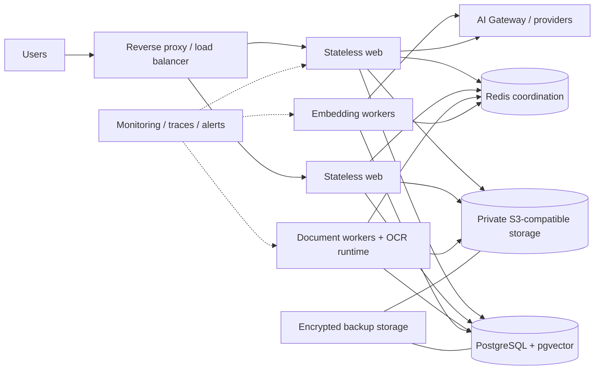

# Production Architecture

## Назначение

Документ фиксирует provider-neutral topology для безопасной эксплуатации
document/OCR/embedding/RAG subsystem. Это reference architecture, а не
подтверждение конкретной production-среды.

## Topology

## Responsibilities

| Component             | Responsibility                                   | Public access    |
| --------------------- | ------------------------------------------------ | ---------------- |
| Reverse proxy         | TLS termination, request limits, rolling routing | HTTPS only       |
| Web                   | Authenticated API/UI, readiness, orchestration   | Through proxy    |
| Document worker       | Checksum, extraction, OCR, chunks                | No               |
| Embedding worker      | Versioned embeddings and vector lifecycle        | No               |
| PostgreSQL/pgvector   | Metadata, vectors, jobs, budgets, ledger, audit  | No               |
| S3-compatible storage | Private originals and derivatives                | No               |
| Redis                 | Queue leases/fencing and distributed limits      | No               |
| AI providers          | Embeddings/answers through AI Gateway only       | Egress allowlist |
| Monitoring            | Logs, metrics, traces and alerts                 | Restricted       |
| Backup storage        | Encrypted isolated copies                        | Restricted       |

## Scaling and isolation

- Web nodes do not store runtime state locally.
- Workers scale independently and use server-time leases with fencing.
- Every job, metadata operation, vector query, ledger entry and audit event is
  tenant-scoped. Tenant comes from server-side identity/configuration.
- Redis keys contain internal hashes/identifiers; queue payload excludes file,
  text, prompt, answer, embedding and credentials.
- Database, Redis, object storage, workers and monitoring reside on private
  networks. Only reverse proxy is externally reachable.

## Deployment sequence

1. Validate secrets/configuration and backup freshness.
2. Run additive migrations once in a dedicated migration job.
3. Deploy workers with claim disabled, then web nodes.
4. Enable new workers and observe heartbeat/queue age.
5. Drain old generation; stale writes are rejected by fencing.
6. Run health, retrieval and backup smoke checks.

Rollback stops the new generation, restores compatible application images and
leaves additive schema in place. Destructive schema rollback is not automatic.

## Availability boundaries

Core document readiness, OCR, embedding/vector and RAG remain separate components.
Production requires configured OCR and RAG boundaries. Queue, worker, budget,
backup and restore state are exposed through restricted operational commands and
metrics without secrets.

## Рекомендации по улучшению

- Validate topology in a staging environment matching expected tenant/document load.
- Add multi-zone placement only after managed-service failure modes are tested.
- Confirm owners, capacity and SLO evidence before go-live approval.

## Связанные документы

- [Architecture 2.0](./ARCHITECTURE_2_0.md)
- [Production Deployment](./PRODUCTION_DEPLOYMENT.md)
- [Queue Operations](./QUEUE_OPERATIONS.md)
- [Observability](./OBSERVABILITY.md)
- [Backup and Restore](./BACKUP_RESTORE.md)
- [TASK-005](./tasks/TASK-005.md)
