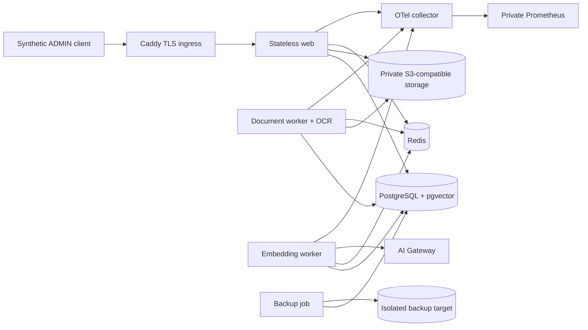

# Staging Architecture

## Purpose

TASK-006 uses one provider-neutral, production-like Docker Compose path. It
validates the process topology from TASK-005 without claiming equivalence to a
specific managed production provider.

## Topology and isolation

Only Caddy publishes ports. Application, data and telemetry networks are
internal. Egress is limited conceptually to provider/telemetry destinations;
the selected host/firewall must implement the final allowlist.

Staging uses its own database, buckets, Redis, secret versions, environment ID
and `staging-*` tenant allowlist. Guards reject production hostnames and
production-like labels. Synthetic data is generated into ignored `.artifacts`.

## Deployment artifacts

- `docker-compose.staging.yml`;
- `docker/staging/Caddyfile`;
- `docker/staging/otel-collector.yml`;
- `docker/staging/prometheus.yml`;
- `docker/production.Dockerfile` targets plus safe secret entrypoint;
- `.env.staging.example`.

## Decision boundary

Compose is selected because TASK-005 already provides five container targets and
a Compose reference. Kubernetes would add a second unvalidated orchestration
model. Migration to a managed scheduler remains possible because services,
probes, secrets, volumes and network responsibilities are explicit.

## Related documents

- [Staging Deployment](./STAGING_DEPLOYMENT.md)
- [Production Architecture](./PRODUCTION_ARCHITECTURE.md)
- [Architecture Decisions](./DECISIONS.md)
- [TASK-006](./tasks/TASK-006.md)
